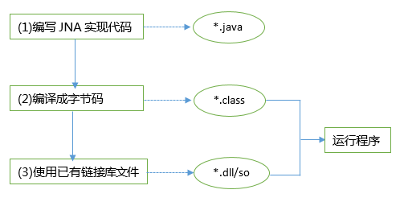

###### 方法
Java调用动态库所需要关心的问题：
 - l 如何装载dll文件，以及如何定位所要使用的方法；
 - l 数据类型是如何对应的；
 - l 如何给使用的方法传递参数；
 - l 如何获取返回的值。
 - 
java调用C++的几种方式包括JNA、JNative、JNI、Jawin、Nativecall、etc等方法。其中比较常用的方式有JNA、JNative、JNI。
###### JNA
> 百度词条（[enter description here](https://baike.baidu.com/item/JNA/8637274?fr=aladdin)）

		JNA(Java Native Access):提供一组Java工具类用于在运行期间动态访问系统本地库（native library：如Window的dll）而不需要编写任何Native/JNI代码。开发人员只要在一个java接口中描述目标native library的函数与结构，JNA将自动实现Java接口到native function的映射。 
		
		JNA(Java Native Access)框架是一个开源的Java框架，是SUN公司主导开发的，建立在经典的JNI的基础之上的一个框架。他不需要用户编写C的代理方法，而是直接提供一组Java工具类用于在运行期动态访问系统本地共享类库而不需要编写任何Native/JNI代码。开发人员只要在一个java接口中描述目标native library的函数与结构，JNA将自动实现Java接口到native function的映射，大大降低了Java调用本体共享库的开发难度。
**==大致流程：==**

		JNA其实现过程如图1所示：	


**==实现步骤：==**

	 1. 下载JNAjar文件：拷贝至系统根目录或者系统system32下。由于JNA是个开源的的项目，其原码放在Github上面的，也有已打包好的jar文件可供直接下载。高版本的JNA提供了可以直接使用的jar包和.so库文件，JNA开发的jna.jar以及.so库文件，
	 
	 2. 配置环境：将下载好的JNAjar放入java项目类的路径下，并且将要调用的动态库放入到项目的更目录下。
	 
	 3. 编写java代码：
	 

``` java
/*< ----------------------------实现PegRoute.dll 文件接口---------------------------- >*/
package com.pingan.security.commonmethods;

import com.sun.jna.Library;
import com.sun.jna.Native;

public interface MyORMInterface extends Library{
	//下面的四个方法是一一对应COperation库中的方法
	public int add(int a,int b); 	
	public int substract(int a,int b); 	
	public int multiplication(int a,int b);
	public float division(int a,int b);
}

/*< ------------------------------加载DLL文件，执行dll方法 ----------------------------- >*/
package com.pingan.security.commonmethods;

import com.pingan.security.commonmethods.MyORMInterface;

public class MyDispatch {
	public static void main(String[] args) {
	//加载DLL文件， 其中COperation是C动态库的库名
	MyORMInterface instance = (MyORMInterface)Native.loadLibrary("COperation", MyORMInterface.class);
		int sum = instance.add(5, 3); 		
		int sub = instance.substract(5, 3); 	
		int mul = instance.multiplication(5, 3); 		
		float div = instance.division(5, 3); 
		System.out.println("add(5,3) = "+ sum); 		
		System.out.println("substract(5,3) = "+ sub); 		
		System.out.println("multiplication(5, 3) = "+ mul); 		
		System.out.println("division(5, 3) = "+ div); 	
	}
}
```
###### JNative		
JNative	一个开源的组件，通过它调用已有动态库中的方法就非常的方便，支持CallBack 。JNative
使用简单，其对数据类型的处理比其他方式做的更好。

**==实现步骤：==**

		下载JNative.zip，解压后获得三个文件，分别是：JNativeCpp.dll，libJNativeCpp.so，JNative.jar 。

		JNativeCpp.dll    Windows下用的，拷到windows / system32目录下；
		
		libJNativeCpp.so Linux下的加载项；
		
		JNative.jar   这是一个扩展包，将其copy到C:\jdk\jre\lib\ext 下（我的目录结构），系统会自动加载。 
		
		

``` java
import org.xvolks.jnative.JNative;  
import org.xvolks.jnative.exceptions.NativeException;  
import org.xvolks.jnative.Type;  
import org.xvolks.jnative.misc.basicStructures.LONG;  
  
public class JNativeT {  
  
    static JNative PegRoute = null;  
  
    public String init() throws NativeException, IllegalAccessException {  
        try {  
            if (PegRoute == null) {  
                // 1. 利用org.xvolks.jnative.JNative来加载DLL：参数1.PegRoute为类名  
                // 2.HCTInitEx方法名  
                PegRoute = new JNative("PegRoute", "HCTInitEx");  
  
                // 2.设置要调用方法中的参数：0 表示第一个以此类推  
                LONG versionLong = new LONG(10);  
                versionLong.setValue(0);  
  
                PegRoute.setParameter(0, Type.LONG, versionLong.toString());  
                PegRoute.setParameter(1, Type.STRING, "");  
  
                // 3.设置返回参数的类型  
                PegRoute.setRetVal(Type.INT);  
                // 4.执行方法  
                PegRoute.invoke();// 调用方法  
            }  
            System.out.println("调用的DLL文件名为：" + PegRoute.getDLLName());  
            System.out.println("调用的方法名为：" + PegRoute.getFunctionName());  
            // 5.返回值  
            return PegRoute.getRetVal();  
        } finally {  
            if (PegRoute != null) {  
                // 6.释放系统资源  
                PegRoute.dispose();  
            }  
        }  
    }  
  
        public static void main(String[] args) throws NativeException,  
            IllegalAccessException {  
          
        String mm = new JNativeT().init();  
        System.out.println(mm);  
    }  
}  
```