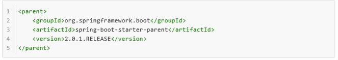
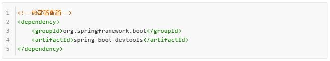

## Maven+SpringBoot+MyBatis

### 1 Maven简述
		maven是一个跨平台的项目管理工具。
		它是Apache的一个开源项目，主要服务于基于Java平台的项目构建，依赖管理和项目信息管理。
		它包含了一个项目对象模型 (Project Object Model)，一组标准集合，一个项目生命周期(Project Lifecycle)，一个依赖管理系统(Dependency Management System)，和用来运行定义在生命周期阶段(phase)中插件(plugin)目标(goal)的逻辑。
### 2 Spring boot简述
		SpringBoot是一个框架。
		一种全新的编程规范，他的产生简化了框架的使用，所谓简化是指简化了Spring众多框架中所需的大量且繁琐的配置文件，开发人员不再需要定义样板化的配置。所以 SpringBoot是一个服务于框架的框架，服务范围是简化配置文件。
**==特点：==**

		1. 创建独立运行的Spring应用程序：Spring boot 可以以jar包形式独立运行，运行一个Spring Boot项目只需要通过java -jar xx.jar来运行。
		2. 内嵌servlet容器，无需部署WAR文件：Spring Boot可以选择内嵌Tomcat、jetty或者Undertow,这样我们无须以war包形式部署项目。
		3. 提供starter简化Maven配置：spring提供了一系列的start pom来简化Maven的依赖加载，例如，当你使用了spring-boot-starter-web,会自动加入依赖包。
		4. 自动配置Spring：SpringBoot会根据在类路径中的jar包，类、为jar包里面的类自动配置Bean，这样会极大地减少我们要使用的配置。
		5. 提供生产就绪型功能准生产的应用监控：SpringBoot提供基于http ssh telnet对运行时的项目进行监控，如指标，健康检查和外部配置。
		6. 绝对没有代码生成并且对XML也没有配置要求：SpringBoot不是借助与代码生成来实现的，而是通过条件注解来实现的，这是Spring4.x提供的新特性。 
### 3 MyBatis简述
		MyBatis 是支持普通 SQL 查询、存储过程和高级映射的优秀持久层框架。
		MyBatis 消除了几乎所有的JDBC代码、参数的手工设置过程以及对结果集的检索。 MyBatis 可以使用简单的XML或注解用于配置和原始映射，将接口和Java的 POJO（ Plain Old Java Objects，普通的Java 对象）映射成数据库中的记录.
		
### 4 Eclipse Maven创建spring boot项目
		1.进入Eclipse，依次File->New->Other,在弹出对话框中，选中Maven Project，如图1所示:

		 2.点击Next按钮，根据自己需要设置，可以使用默认的，继续点击Next,进入如图2所示界面。 

		A、maven-archetype-quickstart:
		默认的Archetype,基本内容包括：
		一个包含junit依赖声明的pom.xml；
		src/main/java主代码目录及一个名为App的类；
		src/test/java测试代码目录及一个名为AppTest的测试用例。
		
       B、maven-archetype-webapp：
		一个最简单的Maven war项目模板，需要快速创建一个Web应用的时候可以使用它。生成的项目内容包括：
		一个packaging为war且带有junit依赖声明的pom.xml
		src/main/webapp/目录
    	src/main/webapp/index.jsp文件
    	src/main/webapp/WEB-INF/web.xml文件
		创建自己的Archetype
		
		C、rchetype Catalog：
		Catalog用来指定maven-archetype-plugin读取archetype-catalog.xml文件的位置：
    	internal——maven-archetype-plugin内置的
    	local——本地的，位置为~/.m2/archetype-catalog.xml
   	 	remote——指向Maven中央仓库的Catalog
   		file://
   		http://
		
		3.选择自己要创建的原型，再点击Next按钮，设置Group Id和Artifact Id，其他项可以不用设置，如图3:

       4.点击Finish按钮，完成项目的创建。
       5.添加SpringBoot的起步依赖：
       		SpringBoot要求，项目要继承SpringBoot的起步依赖spring-boot-starter-parent，如图3所示：

           SpringBoot要继承SpringMVC进行Controller的开发，所以项目要导入web的启动依赖,如图4所示：

		6.编写springBoot引导类
				SpringBoot提供的引导类是程序的访问入口,如图5所示:

		7.编写Controller
				在引导类的同级包或者自己包中创建Controller。
				
				
				知识点解析：
				1）其中@SpringBootApplication：标注SpingBoot的启动类；
				2）SpringApplication.run(MySpringBootApplication.class) 代表运行SpringBoot的启动类，参数为SpringBoot 启动类的字节码对象；
				3）SpringBoot工程热部署：在开发中反复修改类、页面等资源，每次修改后都是需要重新启动才生效，这样每很麻烦，在pom.xml中添加如下配置就可以不重启就能生效，称之为热部署。如图6所示：

				*需要注意的是如果是使用IDEA开发工具进行SpringBoot热部署是会失败的：出此原因的不是热配置的问题，其根本原因是Intellij IEDA默认情况下不会自动编译，需要对IDEA进 行自动编译的设置，如图7所示：

		然后 Shift+Ctrl+Alt+/，选择Registry，如图8所示：

### 5 spring boot原理分析
		1、起步依赖原理分析：按住Ctrl点击pom.xml中的spring-boot-starter-parent，跳转到了spring-boot-starter-parent的pom.xml，再按住Ctrl点击pom.xml中的spring-boot-starter-dependencies，跳转到spring-boot-starter-dependencies的 pom.xml。可以从此POM中看到，一部分的版本、依赖管理、插件管理已经定义好，所以自定义的SpringBoot工程只需要继承spring-boot-starter-parent后已经具备版本锁定等配置了。所以 起步依赖的作用就是进行依赖的传递。 