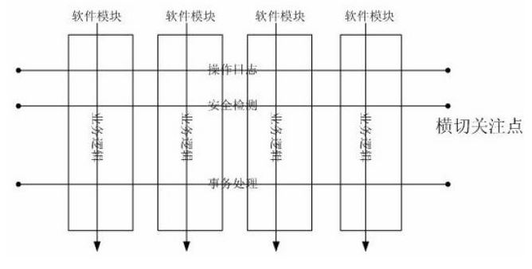

###### AOP定义
		AOP((Aspect-OrientedProgramming))：面向切面的编程。它为解耦而生。OOP是从静态解读的方式来考虑程序的设计结构，我们可以把AOP理解为一种动态解读程序运行过程的编程思想，它是对OOP的补充和完善。
		OOP的三个重要特性封装、继承、多态，构建了一种以对象为基础层次结构，并以此抽象出现实世界事物的一个完整结合，其大大的提升了代码的重用性、灵活性和扩展性。为了实现整体运算，每个对象各自完成自身肩负的任务（处理数据），并通过接口和其它对象交互（收发信息）。然而但我们向这些分散的对象引入公共行为（日志记录、性能监控、安全监测）的时候，OOP则显得有些步履维艰，力有未逮了。在OOP的设计中这些公共事物的代码往往零散的分布在所有对象中，并且和所在对象要处理的核心任务毫无关系，造成了大量的重复代码，同时也引起对象之间耦合度升高。有人将这些分散在对象间用来实现公共事物行为的代码称之为“横切代码”。
		AOP技术的诞生很好的解决了OPP设计中遇到的这种问题，其利用一种称为“横切”的技术，把软件系统分为两个部分：核心关注点和横切关注点。业务处理的主要流程是核心关注点，与之关系不大的部分是横切关注点。AOP将哪些影响了多个类的公共行为（与业务无关，却为业务模块所共同调用的逻辑）封装到一个可重用模块，并将其名为“方面（Aspect）”，以此减少系统的重复代码，降低模块间的耦合度等。
###### AOP模式图
		AOP的设计思路是：定义一个切面，在切面的纵向上定义核心业务处理逻辑，待其处理完成后，再回到横向业务流上。其模式如图1所示：

		从中可以看出AOP业务流不会对我们的核心业务流的纵向走势造成阻碍作用，其使得我们的设计结构和业务变得更加精简和清晰，可以说AOP是对OOP的补充和完善。
###### AOP相关概念
**==切面/方面(aspect)：==**

		横切关注点的模块化(如图1中的操作日志足迹、安全监测组件、事物处理组件)，可以认为是增强、引入和切入点的组合；在Spring中可以使用Schema和@AspectJ方式进行组织实现；类是对物体特征的抽象，切面就是对横切关注点的抽象。在AOP中表示为“在哪里做和做什么集合”。
**==连接点(joinpoint)：==**	

		程序执行过程中明确的点，由于Spring只支持方法类型的连接点，所以在Spring中连接点指的就是被拦截到的方法，实际上连接点还可以是字段或者构造器，如方法的调用或特定的异常被抛出。在AOP中表示为“在哪里做”。
**==切入点(pointcut)：==**	

		对连接点进行拦截的定义，可以认为其是一系列连接点的集合。Spring支持perl5正则表达式和AspectJ切入点模式，Spring默认使用AspectJ语法，在AOP中表示为“在哪里做的集合”。	
**==引入(introduction)：==**	

		添加方法或字段到被通知的类。Spring允许引入新的接口（必须对应一个实现）到所有被代理对象（目标对象）；在不修改代码的前提下，引入可以在运行期为类动态地添加一些方法或字段，在AOP中表示为“做什么（新增什么）”；
**==织入(weave)：==**	
		
		 织入是一个过程，是将切面应用到目标对象从而创建出AOP代理对象的过程，织入可以在编译期、类装载期、运行期进行.pring和其他纯Java AOP框架一样，在运行时完成织入。

