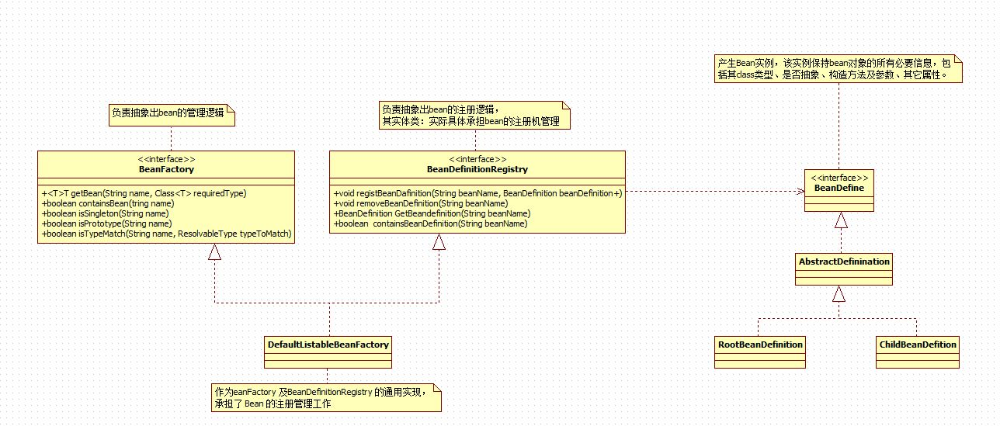

欢迎使用 **{小书匠}(xiaoshujiang)编辑器**，您可以通过 `小书匠主按钮>模板` 里的模板管理来改变新建文章的内容。

### 1 简说
		Spring Boot的魅力主要集中在其四大核心特性：==自动配置==、==起步依赖==、==Actuator==、==命令行界面(CLI)== 。
### 2 Spring IoC容器
		基于Spring Boot框架的程序，其入口是SpringApplication.run()方法，二其本质上则是通过Spring容器来启动的。IoC 容器想要管理各个业务对象以及它们之间的依赖关系，需要通过某种途径来记录和管理这些信息，而BeanDefinition对象就承担了这个责任，其工作原理及关系如图1所示：


		Spring IoC 容器的整个工作流程大致可以分为两个阶段：容器启动阶段和Bean的实例化阶段
		
##### 2.1 容器启动阶段：
		容器通过某种途径加载配置元数据(Configuration MetaData).除了书写代码外，大多数的时候是通过其依赖的工具类，这些工具类加载 Configuration MetaData，并进行解析与分析，然后组装相应的 BeanDefinition，最后会将这些保存了 bean 定义的 BeanDefinition，注册到相应的 BeanDefinitionRegistry 中，以此完成容器的启动工作。
		此阶段主要完成准备性工作，侧重于bean对象管理信息的收集及一些验证或辅助性工作。
		
##### 2.2  Bean的实例化阶段：
		第一阶段所有bean定义都通过 BeanDefinition 的方式注册到 BeanDefinitionRegistry 中，当某个请求通过容器的 getBean 方法请求某个对象，或者因为依赖关系容器需要隐式的调用 getBean 时，就会触发第二阶段的活动：容器会首先检查所请求的对象之前是否已经实例化完成。如果没有，则会根据注册的 BeanDefinition 所提供的信息实例化被请求对象，并为其注入依赖。当该对象装配完毕后，容器会立即将其返回给请求方法使用。
		而在实际场景下，我们更多的使用另外一种类型的容器： ApplicationContext，它构建在 BeanFactory 之上，属于更高级的容器，除了具有 BeanFactory 的所有能力之外，还提供对事件监听机制以及国际化的支持等。它管理的 bean，在容器启动时全部完成初始化和依赖注入操作。
		
##### 2.3 Spring容器扩展机制：
		IoC 容器负责管理容器中所有bean的生命周期，而在 bean 生命周期的不同阶段，Spring 提供了不同的扩展点来改变 bean 的命运。
		在容器的启动阶段， BeanFactoryPostProcessor允许我们在容器实例化相应对象之前，对注册到容器的 BeanDefinition 所保存的信息做一些额外的操作，比如修改 bean 定义的某些属性或者增加其他信息等。如果要自定义扩展类，通常需要实现 org.springframework.beans.factory.config.BeanFactoryPostProcessor接口，与此同时，因为容器中可能有多个BeanFactoryPostProcessor，可能还需要实现 org.springframework.core.Ordered接口，以保证BeanFactoryPostProcessor按照顺序执行。
		与之相似的，还有 BeanPostProcessor，其存在于对象实例化阶段。跟BeanFactoryPostProcessor类似，它会处理容器内所有符合条件并且已经实例化后的对象。简单的对比，BeanFactoryPostProcessor处理bean的定义，而BeanPostProcessor则处理bean完成实例化后的对象。
	
##### 注释：
 
###### 1）IoC（Inversion of Control-控制反转）:
		1）定义：
		它是是面向对象编程中的一种设计原则，可以用来减低计算机代码之间的耦合度。其中最常见的方式叫做依赖注入（Dependency Injection，简称DI），还有一种方式叫“依赖查找”（Dependency Lookup）。通过控制反转，对象在被创建的时候，由一个调控系统内所有对象的外界实体，将其所依赖的对象的引用传递给它。也可以说，依赖被注入到对象中。
		
		2）描述：
		Class A中用到了Class B的对象b，一般情况下，需要在A的代码中显式的new一个B的对象。
		采用依赖注入技术之后，A的代码只需要定义一个私有的B对象，不需要直接new来获得这个对象，而是通过相关的容器控制程序来将B对象在外部new出来并注入到A类里的引用中。而具体获取的方法、对象被获取时的状态由配置文件（如XML）来指定。
		
		3）理解：
		可以认为是一种全新的设计模式，但是理论和时间成熟相对较晚，并没有包含在GoF（设计模式）中。
		实现策略

		IoC是一个很大的概念,可以用不同的方式实现。其主要形式有两种：

    	依赖查找：容器提供回调接口和上下文条件给组件。EJB和Apache Avalon 都使用这种方式。这样一来，组件就必须使用容器提供的API来查找资源和协作对象，仅有的控制反转只体现在那些回调方法上，容器将调用这些回调方法，从而让应用代码获得相关资源。
    	依赖注入：组件不做定位查询，只提供普通的Java方法让容器去决定依赖关系。容器全权负责的组件的装配，它会把符合依赖关系的对象通过JavaBean属性或者构造函数传递给需要的对象。通过JavaBean属性注射依赖关系的做法称为设值方法注入(Setter Injection)；将依赖关系作为构造函数参数传入的做法称为构造器注入（Constructor Injection） 

### 3 JavaConfig与常见Annotation
##### 3.1 JavaConfig（java配置）
		1）定义：JavaConfig就是使用注释来描述Bean配置的组件。JavaConfig 是Spring的一个子项目, 比起Spring，它还是一个非常年青的项目。它基于Java代码和Annotation注解来描述bean之间的依赖绑定关系，目前的版本是1.0 M2。
		
		2）从Spring3开始，JavaConfig功能已经包含在Spring核心模块中，它允许开发者将bean定义和Spring配置放到Java类中来实现。同时，仍允许使用经典的XML方式来定义bean和配置，所以在Spring3以后的版本中，支持xml方式和javaConfig两种Spring配置方式。
		
		3）示例：
``` java
/*<------------------------------------一个简短的组件实例（Bean）------------------------------------>*/
package com.spring;
/*接口*/
public interface HelloWord{
    void printHelloWorld(String msg);
}


package com.spring;
/*实现*/
public class HelloWorldImpl implements HelloWorld{

    @Override
    public void printHelloWorld(String msg) {
        System.out.println("Hello : " + msg);
    }
}


/*<-----------------------------------------.javaConfig注解的使用------------------------------------------>*/
package com.spring;

import org.springframework.context.annotation.Bean;
import org.springframework.context.annotation.Configuration;

/*使用 @Configuration 注释告诉 Spring，这是核心的 Spring 配置文件，
并通过 @Bean 定义 bean*/
@Configuration
public class TestConfig {

    @Bean(name="helloWorld")
    public HelloWorld getHello() {
        return new HelloworldImpl(); 
    }
}


/*<------------------------------------------------main方法测试------------------------------------------------>*/
package com.spring;

import org.springframework.context.ApplicationContext;
import org.springframework.context.annotation.AnnotationConfigApplicationContext;

public class TestMain {
	public static void main(String[] args) {
       ApplicationContext context = new AnnotationConfigApplicationContext(TestConfig.class);
       HelloWorld obj = (HelloWorld) context.getBean("hello world!");  
       obj.printHelloWorld("Spring Java Config");
	}
}
```
##### 3.2 常用Annotation
###### 3.2.1 @ComponentScan
**==1) 是什么==**

		@ComponentScan注解对应XML配置形式中的 <context:component-scan>元素，表示启用组件扫描，Spring会自动扫描所有通过注解配置的bean，然后将其注册到IoC容器中。
**==2) 使用方法==**
``` java
package com.cuijianhua.annotation.controller;
import org.springframework.stereotype.Controller;
@Controller
public class MyUserController {
}

import org.springframework.stereotype.Repository;
@Repository
public class MyUserDao {
}

import org.springframework.stereotype.Service;
@Service
public class MyUserService {
}

@ComponentScan(value="com.cuijianhua")
@Configuration
public class MainScanConfig {
}

//测试
    public static void main(String[] args) {
        SpringApplication.run(TestSpringBootApplication.class);
        ApplicationContext context = new AnnotationConfigApplicationContext(MainScanConfig.class);
        String[] definitionNames = context.getBeanDefinitionNames();
        for (String name : definitionNames) {
            System.out.println(name);
        }
    }
```
**==3) 常用方式==**
  - 自定扫描路径下边带有@Controller，@Service，@Repository，@Component注解加入spring容器
  - 通过includeFilters加入扫描路径下没有以上注解的类加入spring容器
  - 通过excludeFilters过滤出不用加入spring容器的类
  - 自定义增加了@Component注解的注解方式
###### 3.2.2 @Import
**==1) 是什么==**

		@Import注解用于导入配置类。
**==2) 使用方法==**
``` java
@Configuration
public class MoonBookConfiguration {
    @Bean
    public BookService bookService() {
        return new BookServiceImpl();
    }
}
```
		现在有另外一个配置类，比如： MoonUserConfiguration，这个配置类中有一个bean依赖于 MoonBookConfiguration中的bookService，如何将这两个bean组合在一起？借助 @Import即可：

``` java
@Configuration
// 可以同时导入多个配置类，比如：@Import({A.class,B.class})
@Import(MoonBookConfiguration.class)
public class MoonUserConfiguration {
    @Bean
    public UserService userService(BookService bookService) {
        return new BookServiceImpl(bookService);
    }
}
```
**==3) 常用方式==**

		需要注意的是，在4.2之前， @Import注解只支持导入配置类，但是在4.2之后，它支持导入普通类，并将这个类作为一个bean的定义注册到IOC容器中。
###### 3.2.3 @Conditional
**==1) 是什么==**

		@Conditional注解表示在满足某种条件后才初始化一个bean或者启用某些配置。它一般用在由 @Component、 @Service、 @Configuration等注解标识的类上面，或者由 @Bean标记的方法上。如果一个 @Configuration类标记了 @Conditional，则该类中所有标识了 @Bean的方法和 @Import注解导入的相关类将遵从这些条件。
		在Spring里可以很方便的编写你自己的条件类，所要做的就是实现 Condition接口，并覆盖它的 matches()方法。
**==2) 使用方法==**

		举个例子，下面的简单条件类表示只有在 Classpath里存在 JdbcTemplate类时才生效：
		

``` java
public class JdbcTemplateCondition implements Condition {
    @Override
    public boolean matches(ConditionContext conditionContext, AnnotatedTypeMetadata annotatedTypeMetadata) {
        try {
        conditionContext.getClassLoader().loadClass("org.springframework.jdbc.core.JdbcTemplate");
            return true;
        } catch (ClassNotFoundException e) {
            e.printStackTrace();
        }
        return false;
    }
}

/*当你用Java来声明bean的时候，可以使用这个自定义条件类：*/
@Conditional(JdbcTemplateCondition.class)
@Service
public MyService service() {
    ......
}
```
		这个例子中只有当 JdbcTemplateCondition类的条件成立时才会创建MyService这个bean。也就是说MyService这bean的创建条件是 classpath里面包含 JdbcTemplate，否则这个bean的声明就会被忽略掉。
**==3) 常用方式==**		

		SpringBoot定义了很多有趣的条件，并把他们运用到了配置类上，这些配置类构成了 SpringBoot的自动配置的基础。 SpringBoot运用条件化配置的方法是：定义多个特殊的条件化注解，并将它们用到配置类上。下面列出了 SpringBoot提供的部分条件化注解
 -   条件化注解	            |          配置生效条件
 - @ConditionalOnBean	         配置了某个特定bean
 - @ConditionalOnMissingBean	没有配置特定的bean
 - @ConditionalOnClass	Classpath里有指定的类
 - @ConditionalOnMissingClass	Classpath里没有指定的类
 - @ConditionalOnExpression	给定的Spring Expression Language表达式计算结果为true
 - @ConditionalOnJava	Java的版本匹配特定指或者一个范围值
 - @ConditionalOnProperty	指定的配置属性要有一个明确的值
 - @ConditionalOnResource	Classpath里有指定的资源
 - @ConditionalOnWebApplication	这是一个Web应用程序
 - @ConditionalOnNotWebApplication	这不是一个Web应用程序
	
###### 3.2.2 @ConfigurationProperties与@EnableConfigurationProperties
		当某些属性的值需要配置的时候，我们一般会在 application.properties文件中新建配置项，然后在bean中使用 @Value注解来获取配置的值，比如下面配置数据源的代码。
``` java
// jdbc config
jdbc.mysql.url=jdbc:mysql://localhost:3306/sampledb
jdbc.mysql.username=root
jdbc.mysql.password=123456
......

// 配置数据源
@Configuration
public class HikariDataSourceConfiguration {

    @Value("jdbc.mysql.url")
    public String url;
    @Value("jdbc.mysql.username")
    public String user;
    @Value("jdbc.mysql.password")
    public String password;
    
    @Bean
    public HikariDataSource dataSource() {
        HikariConfig hikariConfig = new HikariConfig();
        hikariConfig.setJdbcUrl(url);
        hikariConfig.setUsername(user);
        hikariConfig.setPassword(password);
        // 省略部分代码
        return new HikariDataSource(hikariConfig);
    }
}
```
		使用 @Value注解注入的属性通常都比较简单，如果同一个配置在多个地方使用，也存在不方便维护的问题（考虑下，如果有几十个地方在使用某个配置，而现在你想改下名字，你改怎么做？）。对于更为复杂的配置，Spring Boot提供了更优雅的实现方式，那就是 @ConfigurationProperties注解。我们可以通过下面的方式来改写上面的代码：
``` java
@Component
//  还可以通过@PropertySource("classpath:jdbc.properties")来指定配置文件
@ConfigurationProperties("jdbc.mysql")
// 前缀=jdbc.mysql，会在配置文件中寻找jdbc.mysql.*的配置项
pulic class JdbcConfig {
    public String url;
    public String username;
    public String password;
}

@Configuration
public class HikariDataSourceConfiguration {

    @AutoWired
    public JdbcConfig config;
    
    @Bean
    public HikariDataSource dataSource() {
        HikariConfig hikariConfig = new HikariConfig();
        hikariConfig.setJdbcUrl(config.url);
        hikariConfig.setUsername(config.username);
        hikariConfig.setPassword(config.password);
        // 省略部分代码
        return new HikariDataSource(hikariConfig);
    }
}
``` 
		@ConfigurationProperties对于更为复杂的配置，处理起来也是得心应手，比如有如下配置文件：
``` java
#App
app.menus[0].title=Home
app.menus[0].name=Home
app.menus[0].path=/
app.menus[1].title=Login
app.menus[1].name=Login
app.menus[1].path=/login

app.compiler.timeout=5
app.compiler.output-folder=/temp/

app.error=/error/

可以定义如下配置类来接收这些属性

@Component
@ConfigurationProperties("app")
public class AppProperties {

    public String error;
    public List<Menu> menus = new ArrayList<>();
    public Compiler compiler = new Compiler();

    public static class Menu {
        public String name;
        public String path;
        public String title;
    }

    public static class Compiler {
        public String timeout;
        public String outputFolder;
    }
}
```
		@EnableConfigurationProperties注解表示对 @ConfigurationProperties的内嵌支持，默认会将对应Properties Class作为bean注入的IOC容器中，即在相应的Properties类上不用加 @Component注解。
##### 3.3 SpringFactoriesLoader详解